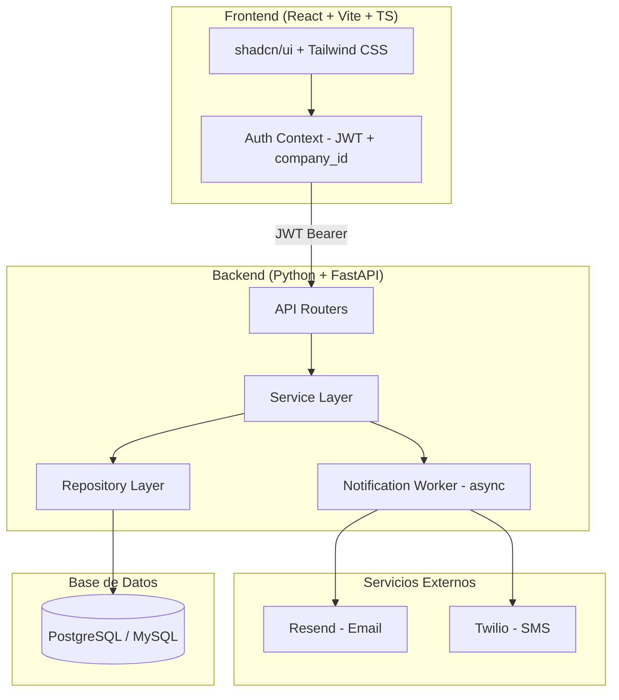
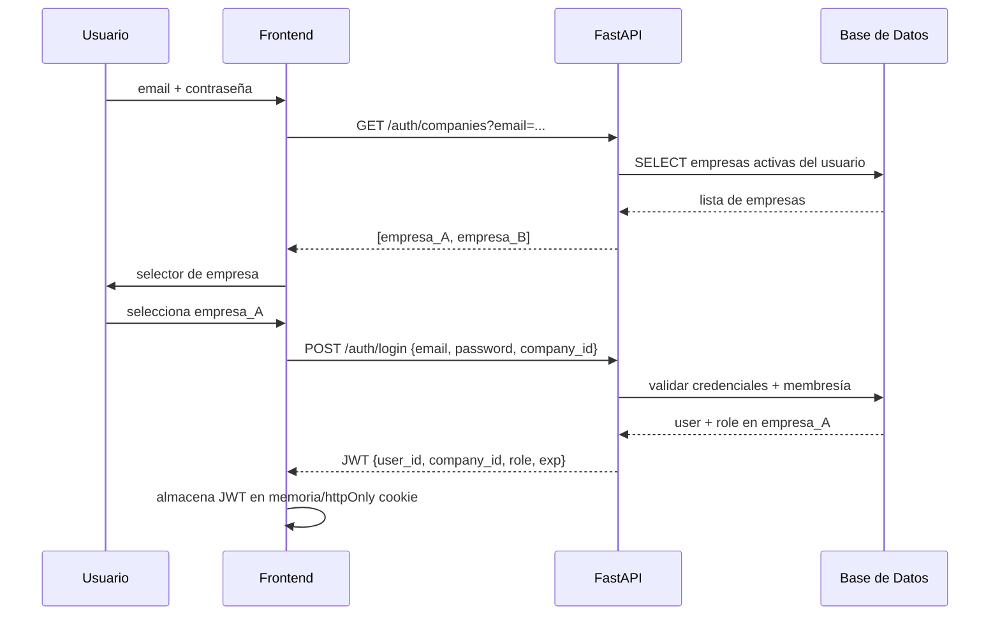
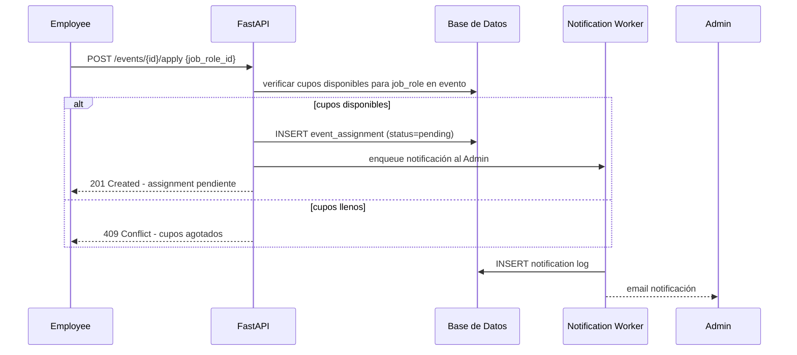
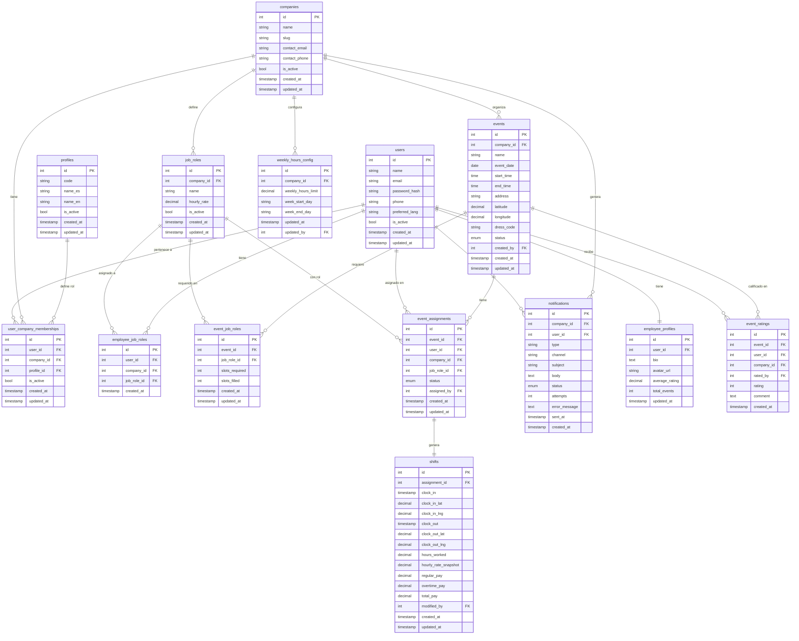

# Documento de Diseño Técnico
# Event Staffing Platform

---

## Descripción General

Plataforma web multitenant responsive para la gestión de eventos sociales y personal. Permite a múltiples empresas (tenants) publicar eventos, asignar empleados por rol laboral, registrar turnos y calcular pagos con control de horas semanales. Un mismo usuario puede pertenecer a varias empresas con roles distintos en cada una.

Stack: Python + FastAPI (backend), React + Vite + TypeScript + shadcn/ui + Tailwind CSS (frontend), PostgreSQL/MySQL (base de datos), JWT (autenticación), Resend (email), Twilio (SMS).

---

## Requisitos No Funcionales

### RNF-01: Rendimiento
- Las respuestas de la API deben completarse en menos de **500ms** para el percentil 95 bajo carga normal.
- Las consultas de reportes (que pueden involucrar múltiples joins) deben completarse en menos de **3 segundos**.
- El sistema debe soportar al menos **100 usuarios concurrentes** por empresa sin degradación perceptible.

### RNF-02: Disponibilidad
- La plataforma debe tener una disponibilidad mínima del **99.5%** mensual.
- Las operaciones de registro de turno (clock-in/clock-out) deben estar disponibles incluso bajo alta carga, ya que son críticas para el negocio.

### RNF-03: Seguridad
- Toda comunicación debe realizarse sobre **HTTPS/TLS 1.2+**.
- Las contraseñas deben almacenarse con **bcrypt** (cost factor ≥ 12).
- Los JWT deben tener expiración máxima de **8 horas** y soporte para revocación.
- El aislamiento multitenant debe ser enforced a nivel de aplicación: cada query debe incluir `company_id` del contexto del token.
- Los endpoints deben validar que el `company_id` del recurso solicitado coincida con el `company_id` del JWT.
- Rate limiting: máximo **60 requests/minuto** por IP en endpoints de autenticación.

### RNF-04: Escalabilidad
- La arquitectura debe permitir escalar horizontalmente el backend (múltiples instancias de FastAPI sin estado).
- La base de datos debe soportar al menos **50 empresas**, **10,000 usuarios** y **100,000 eventos** sin rediseño.

### RNF-05: Mantenibilidad
- El código backend debe seguir la estructura de capas: routers → services → repositories.
- Cobertura de tests unitarios mínima del **70%** en la capa de servicios.
- Toda la API debe estar documentada automáticamente vía **OpenAPI/Swagger** (provisto por FastAPI).

### RNF-06: Usabilidad
- La interfaz debe ser **mobile-first** y funcional en pantallas desde 375px de ancho.
- Los formularios críticos (registro de turno, aplicación a evento) deben completarse en máximo **3 pasos**.
- El tiempo de carga inicial de la SPA no debe superar **3 segundos** en conexión 4G.

### RNF-07: Internacionalización y Multilenguaje
- Las fechas y horas deben almacenarse en **UTC** y convertirse al timezone del usuario en el frontend.
- Los valores monetarios deben almacenarse como `DECIMAL(10,2)` para evitar errores de punto flotante.
- La interfaz debe soportar **español e inglés** como idiomas disponibles.
- El idioma preferido del usuario se almacena en su perfil (`users.preferred_lang`) y puede cambiarse en cualquier momento.
- Todos los textos de la UI deben gestionarse mediante archivos de traducción (i18n con `react-i18next`), sin textos hardcodeados.
- Las notificaciones por email y SMS deben enviarse en el idioma preferido del usuario destinatario.

### RNF-11: Geolocalización
- El registro de inicio y fin de turno debe capturar las coordenadas GPS del empleado via API de Geolocalización del navegador.
- El sistema debe validar que el empleado se encuentre a **500 metros o menos** del lugar del evento al registrar clock-in y clock-out.
- Si el empleado está fuera del radio permitido, el sistema debe rechazar el registro e informar la distancia al evento.
- Las coordenadas del evento (latitud/longitud) deben almacenarse al crear el evento en la tabla `events`.
- Las coordenadas registradas en cada clock-in y clock-out deben almacenarse en `shifts` para auditoría.
- El cálculo de distancia se realiza en el backend usando la fórmula de Haversine.

### RNF-08: Notificaciones
- El sistema de notificaciones debe ser **asíncrono** (no bloquear la respuesta de la API).
- Los fallos de notificación deben reintentarse hasta **3 veces** con backoff exponencial.
- Cada notificación enviada debe quedar registrada en la tabla `notifications` con su estado.

### RNF-09: Auditoría
- Las operaciones críticas (modificación de turnos, cambios de estado de asignación, cambios de tarifa) deben registrar `created_at` y `updated_at` en todas las tablas.
- Las modificaciones de horas por Admin/Coordinator deben ser trazables.

### RNF-10: Portabilidad de Base de Datos
- El diseño de base de datos debe ser compatible con **MySQL 8.0+** y **PostgreSQL 14+**.
- Se proveen scripts DDL para ambos motores.

---

## Arquitectura General



### Flujo de Autenticación Multitenant



### Flujo de Asignación a Evento



---

## Diseño de Base de Datos

### Diagrama Entidad-Relación



---

## Normalización (3FN)

El diseño cumple con la Tercera Forma Normal (3FN):

- **1FN**: Todos los atributos son atómicos. No hay grupos repetitivos ni arrays en columnas.
- **2FN**: Todas las tablas tienen clave primaria simple (`id`). No hay dependencias parciales.
- **3FN**: No hay dependencias transitivas. Por ejemplo:
  - `hourly_rate` vive en `job_roles` (no en `event_assignments`), pero se captura como snapshot en `shifts` para preservar el valor histórico al momento del turno.
  - `slots_filled` en `event_job_roles` es un contador derivado mantenido por la aplicación (alternativa: calcularlo con COUNT en cada consulta; se mantiene desnormalizado por rendimiento con constraint de integridad).
  - `average_rating` y `total_events` en `employee_profiles` son campos desnormalizados por rendimiento, actualizados mediante triggers o lógica de aplicación.

---

## Scripts DDL


### PostgreSQL DDL

```sql
-- ============================================================
-- EVENT STAFFING PLATFORM - DDL PostgreSQL 14+
-- ============================================================

-- Tipos ENUM
CREATE TYPE system_role AS ENUM ('super_admin', 'admin', 'coordinator', 'employee');
CREATE TYPE event_status AS ENUM ('draft', 'published', 'cancelled', 'completed');
CREATE TYPE assignment_status AS ENUM ('pending', 'approved', 'removed');
CREATE TYPE notification_channel AS ENUM ('email', 'sms');
CREATE TYPE notification_status AS ENUM ('pending', 'sent', 'failed');
CREATE TYPE week_day AS ENUM ('monday','tuesday','wednesday','thursday','friday','saturday','sunday');

-- ------------------------------------------------------------
-- profiles  (perfiles/roles del sistema, parametrizables)
-- ------------------------------------------------------------
CREATE TABLE profiles (
    id          SERIAL PRIMARY KEY,
    code        VARCHAR(50)     NOT NULL UNIQUE,
    name_es     VARCHAR(100)    NOT NULL,
    name_en     VARCHAR(100)    NOT NULL,
    is_active   BOOLEAN         NOT NULL DEFAULT TRUE,
    created_at  TIMESTAMPTZ     NOT NULL DEFAULT NOW(),
    updated_at  TIMESTAMPTZ     NOT NULL DEFAULT NOW()
);

INSERT INTO profiles (code, name_es, name_en) VALUES
    ('super_admin', 'Super Administrador', 'Super Administrator'),
    ('admin',       'Administrador',       'Administrator'),
    ('coordinator', 'Coordinador',         'Coordinator'),
    ('employee',    'Empleado',            'Employee');

-- ------------------------------------------------------------
-- companies
-- ------------------------------------------------------------
CREATE TABLE companies (
    id              SERIAL PRIMARY KEY,
    name            VARCHAR(150)    NOT NULL,
    slug            VARCHAR(100)    NOT NULL UNIQUE,
    contact_email   VARCHAR(255)    NOT NULL,
    contact_phone   VARCHAR(30),
    is_active       BOOLEAN         NOT NULL DEFAULT TRUE,
    created_at      TIMESTAMPTZ     NOT NULL DEFAULT NOW(),
    updated_at      TIMESTAMPTZ     NOT NULL DEFAULT NOW()
);

-- ------------------------------------------------------------
-- users  (global, independiente de empresa)
-- ------------------------------------------------------------
CREATE TABLE users (
    id              SERIAL PRIMARY KEY,
    name            VARCHAR(150)    NOT NULL,
    email           VARCHAR(255)    NOT NULL UNIQUE,
    password_hash   VARCHAR(255)    NOT NULL,
    phone           VARCHAR(30),
    preferred_lang  VARCHAR(5)      NOT NULL DEFAULT 'es' CHECK (preferred_lang IN ('es','en')),
    is_active       BOOLEAN         NOT NULL DEFAULT TRUE,
    created_at      TIMESTAMPTZ     NOT NULL DEFAULT NOW(),
    updated_at      TIMESTAMPTZ     NOT NULL DEFAULT NOW()
);

-- ------------------------------------------------------------
-- user_company_memberships  (usuario + empresa + perfil)
-- ------------------------------------------------------------
CREATE TABLE user_company_memberships (
    id          SERIAL PRIMARY KEY,
    user_id     INT             NOT NULL REFERENCES users(id) ON DELETE CASCADE,
    company_id  INT             NOT NULL REFERENCES companies(id) ON DELETE CASCADE,
    profile_id  INT             NOT NULL REFERENCES profiles(id) ON DELETE RESTRICT,
    is_active   BOOLEAN         NOT NULL DEFAULT TRUE,
    created_at  TIMESTAMPTZ     NOT NULL DEFAULT NOW(),
    updated_at  TIMESTAMPTZ     NOT NULL DEFAULT NOW(),
    CONSTRAINT uq_user_company UNIQUE (user_id, company_id)
);

CREATE INDEX idx_ucm_company ON user_company_memberships(company_id);
CREATE INDEX idx_ucm_user    ON user_company_memberships(user_id);

-- ------------------------------------------------------------
-- job_roles  (rol laboral por empresa con tarifa genérica)
-- ------------------------------------------------------------
CREATE TABLE job_roles (
    id          SERIAL PRIMARY KEY,
    company_id  INT             NOT NULL REFERENCES companies(id) ON DELETE CASCADE,
    name        VARCHAR(100)    NOT NULL,
    hourly_rate DECIMAL(10,2)   NOT NULL CHECK (hourly_rate >= 0),
    is_active   BOOLEAN         NOT NULL DEFAULT TRUE,
    created_at  TIMESTAMPTZ     NOT NULL DEFAULT NOW(),
    updated_at  TIMESTAMPTZ     NOT NULL DEFAULT NOW(),
    CONSTRAINT uq_job_role_company UNIQUE (company_id, name)
);

CREATE INDEX idx_job_roles_company ON job_roles(company_id);

-- ------------------------------------------------------------
-- employee_job_roles  (roles que puede desempeñar un empleado en una empresa)
-- ------------------------------------------------------------
CREATE TABLE employee_job_roles (
    id          SERIAL PRIMARY KEY,
    user_id     INT         NOT NULL REFERENCES users(id) ON DELETE CASCADE,
    company_id  INT         NOT NULL REFERENCES companies(id) ON DELETE CASCADE,
    job_role_id INT         NOT NULL REFERENCES job_roles(id) ON DELETE CASCADE,
    created_at  TIMESTAMPTZ NOT NULL DEFAULT NOW(),
    CONSTRAINT uq_employee_job_role UNIQUE (user_id, company_id, job_role_id)
);

CREATE INDEX idx_ejr_user_company ON employee_job_roles(user_id, company_id);

-- ------------------------------------------------------------
-- weekly_hours_config  (límite de horas y rango de semana por empresa)
-- ------------------------------------------------------------
CREATE TABLE weekly_hours_config (
    id                  SERIAL PRIMARY KEY,
    company_id          INT             NOT NULL REFERENCES companies(id) ON DELETE CASCADE,
    weekly_hours_limit  DECIMAL(5,2)    NOT NULL DEFAULT 40.00 CHECK (weekly_hours_limit > 0),
    week_start_day      week_day        NOT NULL DEFAULT 'monday',
    week_end_day        week_day        NOT NULL DEFAULT 'sunday',
    updated_at          TIMESTAMPTZ     NOT NULL DEFAULT NOW(),
    updated_by          INT             REFERENCES users(id) ON DELETE SET NULL,
    CONSTRAINT uq_whc_company UNIQUE (company_id)
);

-- ------------------------------------------------------------
-- events  (incluye coordenadas para validación de geolocalización)
-- ------------------------------------------------------------
CREATE TABLE events (
    id          SERIAL PRIMARY KEY,
    company_id  INT             NOT NULL REFERENCES companies(id) ON DELETE CASCADE,
    name        VARCHAR(200)    NOT NULL,
    event_date  DATE            NOT NULL,
    start_time  TIME            NOT NULL,
    end_time    TIME,
    address     VARCHAR(500)    NOT NULL,
    latitude    DECIMAL(10,7),
    longitude   DECIMAL(10,7),
    dress_code  VARCHAR(200),
    status      event_status    NOT NULL DEFAULT 'draft',
    created_by  INT             NOT NULL REFERENCES users(id) ON DELETE RESTRICT,
    created_at  TIMESTAMPTZ     NOT NULL DEFAULT NOW(),
    updated_at  TIMESTAMPTZ     NOT NULL DEFAULT NOW()
);

CREATE INDEX idx_events_company        ON events(company_id);
CREATE INDEX idx_events_company_date   ON events(company_id, event_date);
CREATE INDEX idx_events_status         ON events(company_id, status);

-- ------------------------------------------------------------
-- event_job_roles  (roles requeridos por evento con cupos)
-- ------------------------------------------------------------
CREATE TABLE event_job_roles (
    id              SERIAL PRIMARY KEY,
    event_id        INT         NOT NULL REFERENCES events(id) ON DELETE CASCADE,
    job_role_id     INT         NOT NULL REFERENCES job_roles(id) ON DELETE RESTRICT,
    slots_required  INT         NOT NULL CHECK (slots_required > 0),
    slots_filled    INT         NOT NULL DEFAULT 0 CHECK (slots_filled >= 0),
    created_at      TIMESTAMPTZ NOT NULL DEFAULT NOW(),
    updated_at      TIMESTAMPTZ NOT NULL DEFAULT NOW(),
    CONSTRAINT uq_event_job_role        UNIQUE (event_id, job_role_id),
    CONSTRAINT chk_slots_not_exceeded   CHECK (slots_filled <= slots_required)
);

CREATE INDEX idx_ejr_event ON event_job_roles(event_id);

-- ------------------------------------------------------------
-- event_assignments  (empleado asignado a evento con rol y estado)
-- ------------------------------------------------------------
CREATE TABLE event_assignments (
    id          SERIAL PRIMARY KEY,
    event_id    INT                 NOT NULL REFERENCES events(id) ON DELETE CASCADE,
    user_id     INT                 NOT NULL REFERENCES users(id) ON DELETE CASCADE,
    company_id  INT                 NOT NULL REFERENCES companies(id) ON DELETE CASCADE,
    job_role_id INT                 NOT NULL REFERENCES job_roles(id) ON DELETE RESTRICT,
    status      assignment_status   NOT NULL DEFAULT 'pending',
    assigned_by INT                 REFERENCES users(id) ON DELETE SET NULL,
    created_at  TIMESTAMPTZ         NOT NULL DEFAULT NOW(),
    updated_at  TIMESTAMPTZ         NOT NULL DEFAULT NOW(),
    CONSTRAINT uq_assignment UNIQUE (event_id, user_id)
);

CREATE INDEX idx_ea_event      ON event_assignments(event_id);
CREATE INDEX idx_ea_user       ON event_assignments(user_id, company_id);
CREATE INDEX idx_ea_company    ON event_assignments(company_id);
CREATE INDEX idx_ea_status     ON event_assignments(event_id, status);

-- ------------------------------------------------------------
-- shifts  (registro de turno con coordenadas GPS de auditoría)
-- ------------------------------------------------------------
CREATE TABLE shifts (
    id                      SERIAL PRIMARY KEY,
    assignment_id           INT             NOT NULL REFERENCES event_assignments(id) ON DELETE CASCADE,
    clock_in                TIMESTAMPTZ,
    clock_in_lat            DECIMAL(10,7),
    clock_in_lng            DECIMAL(10,7),
    clock_out               TIMESTAMPTZ,
    clock_out_lat           DECIMAL(10,7),
    clock_out_lng           DECIMAL(10,7),
    hours_worked            DECIMAL(6,2)    CHECK (hours_worked >= 0),
    hourly_rate_snapshot    DECIMAL(10,2)   NOT NULL CHECK (hourly_rate_snapshot >= 0),
    regular_pay             DECIMAL(10,2)   CHECK (regular_pay >= 0),
    overtime_pay            DECIMAL(10,2)   NOT NULL DEFAULT 0.00 CHECK (overtime_pay >= 0),
    total_pay               DECIMAL(10,2)   CHECK (total_pay >= 0),
    modified_by             INT             REFERENCES users(id) ON DELETE SET NULL,
    created_at              TIMESTAMPTZ     NOT NULL DEFAULT NOW(),
    updated_at              TIMESTAMPTZ     NOT NULL DEFAULT NOW(),
    CONSTRAINT uq_shift_assignment  UNIQUE (assignment_id),
    CONSTRAINT chk_clockout_after   CHECK (clock_out IS NULL OR clock_out > clock_in)
);

CREATE INDEX idx_shifts_assignment ON shifts(assignment_id);

-- ------------------------------------------------------------
-- notifications  (log de notificaciones enviadas)
-- ------------------------------------------------------------
CREATE TABLE notifications (
    id              SERIAL PRIMARY KEY,
    company_id      INT                     NOT NULL REFERENCES companies(id) ON DELETE CASCADE,
    user_id         INT                     NOT NULL REFERENCES users(id) ON DELETE CASCADE,
    type            VARCHAR(100)            NOT NULL,
    channel         notification_channel    NOT NULL,
    subject         VARCHAR(255),
    body            TEXT                    NOT NULL,
    status          notification_status     NOT NULL DEFAULT 'pending',
    attempts        SMALLINT                NOT NULL DEFAULT 0,
    error_message   TEXT,
    sent_at         TIMESTAMPTZ,
    created_at      TIMESTAMPTZ             NOT NULL DEFAULT NOW()
);

CREATE INDEX idx_notif_user     ON notifications(user_id);
CREATE INDEX idx_notif_company  ON notifications(company_id);
CREATE INDEX idx_notif_status   ON notifications(status);

-- ------------------------------------------------------------
-- employee_profiles  (perfil opcional del empleado)
-- ------------------------------------------------------------
CREATE TABLE employee_profiles (
    id              SERIAL PRIMARY KEY,
    user_id         INT             NOT NULL REFERENCES users(id) ON DELETE CASCADE UNIQUE,
    bio             TEXT,
    avatar_url      VARCHAR(500),
    average_rating  DECIMAL(3,2)    CHECK (average_rating BETWEEN 1.00 AND 5.00),
    total_events    INT             NOT NULL DEFAULT 0 CHECK (total_events >= 0),
    updated_at      TIMESTAMPTZ     NOT NULL DEFAULT NOW()
);

-- ------------------------------------------------------------
-- event_ratings  (calificaciones por evento y empleado)
-- ------------------------------------------------------------
CREATE TABLE event_ratings (
    id          SERIAL PRIMARY KEY,
    event_id    INT         NOT NULL REFERENCES events(id) ON DELETE CASCADE,
    user_id     INT         NOT NULL REFERENCES users(id) ON DELETE CASCADE,
    company_id  INT         NOT NULL REFERENCES companies(id) ON DELETE CASCADE,
    rated_by    INT         NOT NULL REFERENCES users(id) ON DELETE RESTRICT,
    rating      SMALLINT    NOT NULL CHECK (rating BETWEEN 1 AND 5),
    comment     TEXT,
    created_at  TIMESTAMPTZ NOT NULL DEFAULT NOW(),
    CONSTRAINT uq_rating_event_user UNIQUE (event_id, user_id)
);

CREATE INDEX idx_ratings_user    ON event_ratings(user_id);
CREATE INDEX idx_ratings_event   ON event_ratings(event_id);
CREATE INDEX idx_ratings_company ON event_ratings(company_id);
```


### MySQL DDL

```sql
-- ============================================================
-- EVENT STAFFING PLATFORM - DDL MySQL 8.0+
-- ============================================================
el 
SET FOREIGN_KEY_CHECKS = 0;

-- ------------------------------------------------------------
-- profiles  (perfiles/roles del sistema)
-- ------------------------------------------------------------
CREATE TABLE profiles (
    id          INT             NOT NULL AUTO_INCREMENT PRIMARY KEY,
    code        VARCHAR(50)     NOT NULL,
    name_es     VARCHAR(100)    NOT NULL,
    name_en     VARCHAR(100)    NOT NULL,
    is_active   TINYINT(1)      NOT NULL DEFAULT 1,
    created_at  DATETIME(6)     NOT NULL DEFAULT CURRENT_TIMESTAMP(6),
    updated_at  DATETIME(6)     NOT NULL DEFAULT CURRENT_TIMESTAMP(6) ON UPDATE CURRENT_TIMESTAMP(6),
    CONSTRAINT uq_profiles_code UNIQUE (code)
) ENGINE=InnoDB DEFAULT CHARSET=utf8mb4 COLLATE=utf8mb4_unicode_ci;

INSERT INTO profiles (code, name_es, name_en) VALUES
    ('super_admin', 'Super Administrador', 'Super Administrator'),
    ('admin',       'Administrador',       'Administrator'),
    ('coordinator', 'Coordinador',         'Coordinator'),
    ('employee',    'Empleado',            'Employee');

-- ------------------------------------------------------------
-- companies
-- ------------------------------------------------------------
CREATE TABLE companies (
    id              INT             NOT NULL AUTO_INCREMENT PRIMARY KEY,
    name            VARCHAR(150)    NOT NULL,
    slug            VARCHAR(100)    NOT NULL,
    contact_email   VARCHAR(255)    NOT NULL,
    contact_phone   VARCHAR(30),
    is_active       TINYINT(1)      NOT NULL DEFAULT 1,
    created_at      DATETIME(6)     NOT NULL DEFAULT CURRENT_TIMESTAMP(6),
    updated_at      DATETIME(6)     NOT NULL DEFAULT CURRENT_TIMESTAMP(6) ON UPDATE CURRENT_TIMESTAMP(6),
    CONSTRAINT uq_companies_slug UNIQUE (slug)
) ENGINE=InnoDB DEFAULT CHARSET=utf8mb4 COLLATE=utf8mb4_unicode_ci;

-- ------------------------------------------------------------
-- users
-- ------------------------------------------------------------
CREATE TABLE users (
    id              INT             NOT NULL AUTO_INCREMENT PRIMARY KEY,
    name            VARCHAR(150)    NOT NULL,
    email           VARCHAR(255)    NOT NULL,
    password_hash   VARCHAR(255)    NOT NULL,
    phone           VARCHAR(30),
    preferred_lang  VARCHAR(5)      NOT NULL DEFAULT 'es',
    is_active       TINYINT(1)      NOT NULL DEFAULT 1,
    created_at      DATETIME(6)     NOT NULL DEFAULT CURRENT_TIMESTAMP(6),
    updated_at      DATETIME(6)     NOT NULL DEFAULT CURRENT_TIMESTAMP(6) ON UPDATE CURRENT_TIMESTAMP(6),
    CONSTRAINT uq_users_email       UNIQUE (email),
    CONSTRAINT chk_preferred_lang   CHECK (preferred_lang IN ('es','en'))
) ENGINE=InnoDB DEFAULT CHARSET=utf8mb4 COLLATE=utf8mb4_unicode_ci;

-- ------------------------------------------------------------
-- user_company_memberships  (usuario + empresa + perfil)
-- ------------------------------------------------------------
CREATE TABLE user_company_memberships (
    id          INT         NOT NULL AUTO_INCREMENT PRIMARY KEY,
    user_id     INT         NOT NULL,
    company_id  INT         NOT NULL,
    profile_id  INT         NOT NULL,
    is_active   TINYINT(1)  NOT NULL DEFAULT 1,
    created_at  DATETIME(6) NOT NULL DEFAULT CURRENT_TIMESTAMP(6),
    updated_at  DATETIME(6) NOT NULL DEFAULT CURRENT_TIMESTAMP(6) ON UPDATE CURRENT_TIMESTAMP(6),
    CONSTRAINT uq_user_company  UNIQUE (user_id, company_id),
    CONSTRAINT fk_ucm_user      FOREIGN KEY (user_id)    REFERENCES users(id)     ON DELETE CASCADE,
    CONSTRAINT fk_ucm_company   FOREIGN KEY (company_id) REFERENCES companies(id) ON DELETE CASCADE,
    CONSTRAINT fk_ucm_profile   FOREIGN KEY (profile_id) REFERENCES profiles(id)  ON DELETE RESTRICT
) ENGINE=InnoDB DEFAULT CHARSET=utf8mb4 COLLATE=utf8mb4_unicode_ci;

CREATE INDEX idx_ucm_company ON user_company_memberships(company_id);
CREATE INDEX idx_ucm_user    ON user_company_memberships(user_id);

-- ------------------------------------------------------------
-- job_roles
-- ------------------------------------------------------------
CREATE TABLE job_roles (
    id          INT             NOT NULL AUTO_INCREMENT PRIMARY KEY,
    company_id  INT             NOT NULL,
    name        VARCHAR(100)    NOT NULL,
    hourly_rate DECIMAL(10,2)   NOT NULL,
    is_active   TINYINT(1)      NOT NULL DEFAULT 1,
    created_at  DATETIME(6)     NOT NULL DEFAULT CURRENT_TIMESTAMP(6),
    updated_at  DATETIME(6)     NOT NULL DEFAULT CURRENT_TIMESTAMP(6) ON UPDATE CURRENT_TIMESTAMP(6),
    CONSTRAINT uq_job_role_company  UNIQUE (company_id, name),
    CONSTRAINT chk_hourly_rate      CHECK (hourly_rate >= 0),
    CONSTRAINT fk_jr_company        FOREIGN KEY (company_id) REFERENCES companies(id) ON DELETE CASCADE
) ENGINE=InnoDB DEFAULT CHARSET=utf8mb4 COLLATE=utf8mb4_unicode_ci;

CREATE INDEX idx_job_roles_company ON job_roles(company_id);

-- ------------------------------------------------------------
-- employee_job_roles
-- ------------------------------------------------------------
CREATE TABLE employee_job_roles (
    id          INT         NOT NULL AUTO_INCREMENT PRIMARY KEY,
    user_id     INT         NOT NULL,
    company_id  INT         NOT NULL,
    job_role_id INT         NOT NULL,
    created_at  DATETIME(6) NOT NULL DEFAULT CURRENT_TIMESTAMP(6),
    CONSTRAINT uq_employee_job_role UNIQUE (user_id, company_id, job_role_id),
    CONSTRAINT fk_ejr_user          FOREIGN KEY (user_id)     REFERENCES users(id)     ON DELETE CASCADE,
    CONSTRAINT fk_ejr_company       FOREIGN KEY (company_id)  REFERENCES companies(id) ON DELETE CASCADE,
    CONSTRAINT fk_ejr_job_role      FOREIGN KEY (job_role_id) REFERENCES job_roles(id) ON DELETE CASCADE
) ENGINE=InnoDB DEFAULT CHARSET=utf8mb4 COLLATE=utf8mb4_unicode_ci;

CREATE INDEX idx_ejr_user_company ON employee_job_roles(user_id, company_id);

-- ------------------------------------------------------------
-- weekly_hours_config  (límite de horas y rango de semana por empresa)
-- ------------------------------------------------------------
CREATE TABLE weekly_hours_config (
    id                  INT             NOT NULL AUTO_INCREMENT PRIMARY KEY,
    company_id          INT             NOT NULL,
    weekly_hours_limit  DECIMAL(5,2)    NOT NULL DEFAULT 40.00,
    week_start_day      ENUM('monday','tuesday','wednesday','thursday','friday','saturday','sunday') NOT NULL DEFAULT 'monday',
    week_end_day        ENUM('monday','tuesday','wednesday','thursday','friday','saturday','sunday') NOT NULL DEFAULT 'sunday',
    updated_at          DATETIME(6)     NOT NULL DEFAULT CURRENT_TIMESTAMP(6) ON UPDATE CURRENT_TIMESTAMP(6),
    updated_by          INT,
    CONSTRAINT uq_whc_company       UNIQUE (company_id),
    CONSTRAINT chk_hours_limit      CHECK (weekly_hours_limit > 0),
    CONSTRAINT fk_whc_company       FOREIGN KEY (company_id) REFERENCES companies(id) ON DELETE CASCADE,
    CONSTRAINT fk_whc_updated_by    FOREIGN KEY (updated_by) REFERENCES users(id)     ON DELETE SET NULL
) ENGINE=InnoDB DEFAULT CHARSET=utf8mb4 COLLATE=utf8mb4_unicode_ci;

-- ------------------------------------------------------------
-- events  (incluye coordenadas para validación de geolocalización)
-- ------------------------------------------------------------
CREATE TABLE events (
    id          INT             NOT NULL AUTO_INCREMENT PRIMARY KEY,
    company_id  INT             NOT NULL,
    name        VARCHAR(200)    NOT NULL,
    event_date  DATE            NOT NULL,
    start_time  TIME            NOT NULL,
    end_time    TIME,
    address     VARCHAR(500)    NOT NULL,
    latitude    DECIMAL(10,7),
    longitude   DECIMAL(10,7),
    dress_code  VARCHAR(200),
    status      ENUM('draft','published','cancelled','completed') NOT NULL DEFAULT 'draft',
    created_by  INT             NOT NULL,
    created_at  DATETIME(6)     NOT NULL DEFAULT CURRENT_TIMESTAMP(6),
    updated_at  DATETIME(6)     NOT NULL DEFAULT CURRENT_TIMESTAMP(6) ON UPDATE CURRENT_TIMESTAMP(6),
    CONSTRAINT fk_events_company    FOREIGN KEY (company_id) REFERENCES companies(id) ON DELETE CASCADE,
    CONSTRAINT fk_events_created_by FOREIGN KEY (created_by) REFERENCES users(id)     ON DELETE RESTRICT
) ENGINE=InnoDB DEFAULT CHARSET=utf8mb4 COLLATE=utf8mb4_unicode_ci;

CREATE INDEX idx_events_company      ON events(company_id);
CREATE INDEX idx_events_company_date ON events(company_id, event_date);
CREATE INDEX idx_events_status       ON events(company_id, status);

-- ------------------------------------------------------------
-- event_job_roles
-- ------------------------------------------------------------
CREATE TABLE event_job_roles (
    id              INT         NOT NULL AUTO_INCREMENT PRIMARY KEY,
    event_id        INT         NOT NULL,
    job_role_id     INT         NOT NULL,
    slots_required  INT         NOT NULL,
    slots_filled    INT         NOT NULL DEFAULT 0,
    created_at      DATETIME(6) NOT NULL DEFAULT CURRENT_TIMESTAMP(6),
    updated_at      DATETIME(6) NOT NULL DEFAULT CURRENT_TIMESTAMP(6) ON UPDATE CURRENT_TIMESTAMP(6),
    CONSTRAINT uq_event_job_role        UNIQUE (event_id, job_role_id),
    CONSTRAINT chk_slots_required       CHECK (slots_required > 0),
    CONSTRAINT chk_slots_filled         CHECK (slots_filled >= 0),
    CONSTRAINT chk_slots_not_exceeded   CHECK (slots_filled <= slots_required),
    CONSTRAINT fk_ejr2_event            FOREIGN KEY (event_id)    REFERENCES events(id)    ON DELETE CASCADE,
    CONSTRAINT fk_ejr2_job_role         FOREIGN KEY (job_role_id) REFERENCES job_roles(id) ON DELETE RESTRICT
) ENGINE=InnoDB DEFAULT CHARSET=utf8mb4 COLLATE=utf8mb4_unicode_ci;

CREATE INDEX idx_event_job_roles_event ON event_job_roles(event_id);

-- ------------------------------------------------------------
-- event_assignments
-- ------------------------------------------------------------
CREATE TABLE event_assignments (
    id          INT         NOT NULL AUTO_INCREMENT PRIMARY KEY,
    event_id    INT         NOT NULL,
    user_id     INT         NOT NULL,
    company_id  INT         NOT NULL,
    job_role_id INT         NOT NULL,
    status      ENUM('pending','approved','removed') NOT NULL DEFAULT 'pending',
    assigned_by INT,
    created_at  DATETIME(6) NOT NULL DEFAULT CURRENT_TIMESTAMP(6),
    updated_at  DATETIME(6) NOT NULL DEFAULT CURRENT_TIMESTAMP(6) ON UPDATE CURRENT_TIMESTAMP(6),
    CONSTRAINT uq_assignment            UNIQUE (event_id, user_id),
    CONSTRAINT fk_ea_event              FOREIGN KEY (event_id)    REFERENCES events(id)    ON DELETE CASCADE,
    CONSTRAINT fk_ea_user               FOREIGN KEY (user_id)     REFERENCES users(id)     ON DELETE CASCADE,
    CONSTRAINT fk_ea_company            FOREIGN KEY (company_id)  REFERENCES companies(id) ON DELETE CASCADE,
    CONSTRAINT fk_ea_job_role           FOREIGN KEY (job_role_id) REFERENCES job_roles(id) ON DELETE RESTRICT,
    CONSTRAINT fk_ea_assigned_by        FOREIGN KEY (assigned_by) REFERENCES users(id)     ON DELETE SET NULL
) ENGINE=InnoDB DEFAULT CHARSET=utf8mb4 COLLATE=utf8mb4_unicode_ci;

CREATE INDEX idx_ea_event   ON event_assignments(event_id);
CREATE INDEX idx_ea_user    ON event_assignments(user_id, company_id);
CREATE INDEX idx_ea_company ON event_assignments(company_id);
CREATE INDEX idx_ea_status  ON event_assignments(event_id, status);

-- ------------------------------------------------------------
-- shifts  (registro de turno con coordenadas GPS de auditoría)
-- ------------------------------------------------------------
CREATE TABLE shifts (
    id                      INT             NOT NULL AUTO_INCREMENT PRIMARY KEY,
    assignment_id           INT             NOT NULL,
    clock_in                DATETIME(6),
    clock_in_lat            DECIMAL(10,7),
    clock_in_lng            DECIMAL(10,7),
    clock_out               DATETIME(6),
    clock_out_lat           DECIMAL(10,7),
    clock_out_lng           DECIMAL(10,7),
    hours_worked            DECIMAL(6,2),
    hourly_rate_snapshot    DECIMAL(10,2)   NOT NULL,
    regular_pay             DECIMAL(10,2),
    overtime_pay            DECIMAL(10,2)   NOT NULL DEFAULT 0.00,
    total_pay               DECIMAL(10,2),
    modified_by             INT,
    created_at              DATETIME(6)     NOT NULL DEFAULT CURRENT_TIMESTAMP(6),
    updated_at              DATETIME(6)     NOT NULL DEFAULT CURRENT_TIMESTAMP(6) ON UPDATE CURRENT_TIMESTAMP(6),
    CONSTRAINT uq_shift_assignment      UNIQUE (assignment_id),
    CONSTRAINT chk_shift_hours          CHECK (hours_worked IS NULL OR hours_worked >= 0),
    CONSTRAINT chk_shift_rate           CHECK (hourly_rate_snapshot >= 0),
    CONSTRAINT chk_shift_overtime       CHECK (overtime_pay >= 0),
    CONSTRAINT fk_shifts_assignment     FOREIGN KEY (assignment_id) REFERENCES event_assignments(id) ON DELETE CASCADE,
    CONSTRAINT fk_shifts_modified_by    FOREIGN KEY (modified_by)   REFERENCES users(id)             ON DELETE SET NULL
) ENGINE=InnoDB DEFAULT CHARSET=utf8mb4 COLLATE=utf8mb4_unicode_ci;

CREATE INDEX idx_shifts_assignment ON shifts(assignment_id);

-- ------------------------------------------------------------
-- notifications
-- ------------------------------------------------------------
CREATE TABLE notifications (
    id              INT         NOT NULL AUTO_INCREMENT PRIMARY KEY,
    company_id      INT         NOT NULL,
    user_id         INT         NOT NULL,
    type            VARCHAR(100) NOT NULL,
    channel         ENUM('email','sms') NOT NULL,
    subject         VARCHAR(255),
    body            TEXT        NOT NULL,
    status          ENUM('pending','sent','failed') NOT NULL DEFAULT 'pending',
    attempts        SMALLINT    NOT NULL DEFAULT 0,
    error_message   TEXT,
    sent_at         DATETIME(6),
    created_at      DATETIME(6) NOT NULL DEFAULT CURRENT_TIMESTAMP(6),
    CONSTRAINT fk_notif_company FOREIGN KEY (company_id) REFERENCES companies(id) ON DELETE CASCADE,
    CONSTRAINT fk_notif_user    FOREIGN KEY (user_id)    REFERENCES users(id)     ON DELETE CASCADE
) ENGINE=InnoDB DEFAULT CHARSET=utf8mb4 COLLATE=utf8mb4_unicode_ci;

CREATE INDEX idx_notif_user    ON notifications(user_id);
CREATE INDEX idx_notif_company ON notifications(company_id);
CREATE INDEX idx_notif_status  ON notifications(status);

-- ------------------------------------------------------------
-- employee_profiles
-- ------------------------------------------------------------
CREATE TABLE employee_profiles (
    id              INT             NOT NULL AUTO_INCREMENT PRIMARY KEY,
    user_id         INT             NOT NULL,
    bio             TEXT,
    avatar_url      VARCHAR(500),
    average_rating  DECIMAL(3,2),
    total_events    INT             NOT NULL DEFAULT 0,
    updated_at      DATETIME(6)     NOT NULL DEFAULT CURRENT_TIMESTAMP(6) ON UPDATE CURRENT_TIMESTAMP(6),
    CONSTRAINT uq_profile_user      UNIQUE (user_id),
    CONSTRAINT chk_avg_rating       CHECK (average_rating IS NULL OR (average_rating BETWEEN 1.00 AND 5.00)),
    CONSTRAINT chk_total_events     CHECK (total_events >= 0),
    CONSTRAINT fk_profile_user      FOREIGN KEY (user_id) REFERENCES users(id) ON DELETE CASCADE
) ENGINE=InnoDB DEFAULT CHARSET=utf8mb4 COLLATE=utf8mb4_unicode_ci;

-- ------------------------------------------------------------
-- event_ratings
-- ------------------------------------------------------------
CREATE TABLE event_ratings (
    id          INT         NOT NULL AUTO_INCREMENT PRIMARY KEY,
    event_id    INT         NOT NULL,
    user_id     INT         NOT NULL,
    company_id  INT         NOT NULL,
    rated_by    INT         NOT NULL,
    rating      SMALLINT    NOT NULL,
    comment     TEXT,
    created_at  DATETIME(6) NOT NULL DEFAULT CURRENT_TIMESTAMP(6),
    CONSTRAINT uq_rating_event_user UNIQUE (event_id, user_id),
    CONSTRAINT chk_rating_value     CHECK (rating BETWEEN 1 AND 5),
    CONSTRAINT fk_er_event          FOREIGN KEY (event_id)   REFERENCES events(id)    ON DELETE CASCADE,
    CONSTRAINT fk_er_user           FOREIGN KEY (user_id)    REFERENCES users(id)     ON DELETE CASCADE,
    CONSTRAINT fk_er_company        FOREIGN KEY (company_id) REFERENCES companies(id) ON DELETE CASCADE,
    CONSTRAINT fk_er_rated_by       FOREIGN KEY (rated_by)   REFERENCES users(id)     ON DELETE RESTRICT
) ENGINE=InnoDB DEFAULT CHARSET=utf8mb4 COLLATE=utf8mb4_unicode_ci;

CREATE INDEX idx_ratings_user    ON event_ratings(user_id);
CREATE INDEX idx_ratings_event   ON event_ratings(event_id);
CREATE INDEX idx_ratings_company ON event_ratings(company_id);

SET FOREIGN_KEY_CHECKS = 1;
```


---

## Reglas de Negocio Reflejadas en el Esquema

### Multitenancy
- Todas las tablas operacionales incluyen `company_id` con FK a `companies`.
- El aislamiento se enforza en la capa de aplicación: cada query incluye `company_id` del JWT.
- `users` es la única tabla global (sin `company_id`) porque un usuario puede pertenecer a múltiples empresas.

### Tarifa por hora genérica por Job_Role + Company
- `hourly_rate` vive en `job_roles` (no en `employee_job_roles` ni en `event_assignments`).
- Al crear un `shift`, se copia el valor vigente en `hourly_rate_snapshot` para preservar el histórico si la tarifa cambia después.

### Un empleado, un rol por evento
- `event_assignments` tiene `UNIQUE (event_id, user_id)`: un empleado solo puede tener una asignación por evento.
- El `job_role_id` en `event_assignments` define con qué rol específico participa en ese evento.

### Control de cupos
- `event_job_roles.slots_filled` se incrementa/decrementa atómicamente cuando una asignación pasa a estado `approved` o `removed`.
- El constraint `CHECK (slots_filled <= slots_required)` previene sobrepaso a nivel de base de datos.
- La lógica de bloqueo de aplicaciones cuando los cupos están llenos se implementa en la capa de servicio antes del INSERT.

### Cálculo de pago con recargo
```
horas_regulares = MIN(hours_worked, weekly_hours_remaining)
horas_extra     = MAX(0, hours_worked - weekly_hours_remaining)
regular_pay     = horas_regulares × hourly_rate_snapshot
overtime_pay    = horas_extra × hourly_rate_snapshot × 1.5
total_pay       = regular_pay + overtime_pay
```
- `weekly_hours_remaining` se calcula sumando los `hours_worked` de todos los shifts del empleado en la semana definida por `week_start_day` y `week_end_day` de `weekly_hours_config` para la empresa.
- El límite semanal se obtiene de `weekly_hours_config.weekly_hours_limit` para la empresa.
- El rango de semana es configurable por empresa (ej. lunes a domingo, o domingo a sábado).

### Estados de Event_Assignment
```
pending  →  approved  (Admin aprueba)
pending  →  removed   (Admin rechaza o remueve)
approved →  removed   (Admin remueve empleado aprobado)
```

### Perfiles de Sistema (tabla `profiles`)
- Los roles del sistema (`super_admin`, `admin`, `coordinator`, `employee`) se almacenan en la tabla `profiles` con nombre en español e inglés.
- `user_company_memberships.profile_id` referencia a `profiles` en lugar de usar un ENUM hardcodeado.
- Esto permite agregar nuevos perfiles sin cambios de esquema.

### Geolocalización en Turnos
- `events` almacena `latitude` y `longitude` del lugar del evento.
- `shifts` almacena coordenadas de clock-in (`clock_in_lat`, `clock_in_lng`) y clock-out (`clock_out_lat`, `clock_out_lng`) para auditoría.
- La validación de distancia (≤ 500m) se realiza en el backend con la fórmula de Haversine antes de registrar el turno.

### Vista del Evento para el Empleado
Cuando un empleado consulta el detalle de un evento al que ha aplicado, la API retorna:
- Nombre y fecha del evento
- Dirección del lugar
- Dress code requerido
- Rol con el que está aplicando (`job_roles.name`)
- Valor por hora que se pagará (`job_roles.hourly_rate`)
- Estado actual de su asignación (`event_assignments.status`: publicado / pendiente / aprobado)

### Multilenguaje
- `users.preferred_lang` almacena el idioma preferido (`es` o `en`).
- `profiles.name_es` y `profiles.name_en` permiten mostrar el nombre del perfil en el idioma del usuario.
- Las notificaciones se envían en el idioma del destinatario.
- `hourly_rate_snapshot` se copia desde `job_roles.hourly_rate` al momento de crear el shift (clock-in).
- Esto garantiza que modificar la tarifa de un rol no afecta shifts ya registrados (Requisito 4.2).

---

## Componentes y Capas del Backend

```mermaid
graph LR
    subgraph API ["FastAPI Routers"]
        R1[/auth]
        R2[/companies]
        R3[/users]
        R4[/job-roles]
        R5[/events]
        R6[/assignments]
        R7[/shifts]
        R8[/reports]
        R9[/notifications]
    end

    subgraph Services ["Service Layer"]
        S1[AuthService]
        S2[CompanyService]
        S3[UserService]
        S4[JobRoleService]
        S5[EventService]
        S6[AssignmentService]
        S7[ShiftService]
        S8[ReportService]
        S9[NotificationService]
        S10[PaymentCalculator]
    end

    subgraph Repos ["Repository Layer (SQLAlchemy)"]
        DB[(PostgreSQL / MySQL)]
    end

    subgraph Workers ["Async Workers"]
        W1[EmailWorker - Resend]
        W2[SMSWorker - Twilio]
    end

    R1 --> S1
    R2 --> S2
    R3 --> S3
    R4 --> S4
    R5 --> S5
    R6 --> S6
    R7 --> S7
    R8 --> S8
    R9 --> S9
    S6 --> S10
    S7 --> S10
    S5 --> S9
    S6 --> S9
    Services --> Repos
    S9 --> W1
    S9 --> W2
```

### Interfaces Principales (Python + FastAPI)

```python
# Contexto de autenticación extraído del JWT
class AuthContext:
    user_id: int
    company_id: int
    role: Literal["super_admin", "admin", "coordinator", "employee"]

# Servicio de cálculo de pagos
class PaymentCalculator:
    def calculate_shift_pay(
        assignment_id: int,
        clock_in: datetime,
        clock_out: datetime,
        hourly_rate: Decimal,
        weekly_hours_limit: Decimal,
        hours_worked_this_week: Decimal
    ) -> ShiftPayResult:
        ...

# Resultado del cálculo
class ShiftPayResult:
    hours_worked: Decimal
    regular_pay: Decimal
    overtime_pay: Decimal
    total_pay: Decimal
    exceeded_weekly_limit: bool

# Servicio de notificaciones (asíncrono)
class NotificationService:
    async def send(
        user_id: int,
        company_id: int,
        notification_type: str,
        channel: Literal["email", "sms"],
        context: dict
    ) -> None:
        # Inserta en tabla notifications y encola envío
        ...
```

---

## Estrategia de Testing

### Tests Unitarios
- Capa de servicios: `pytest` con mocks de repositorios.
- `PaymentCalculator`: tests parametrizados con casos de horas regulares, horas extra y combinaciones.
- Cobertura mínima: 70% en servicios.

### Tests de Propiedades (Property-Based Testing)
- Librería: `hypothesis` (Python).
- Propiedad 1: Para cualquier combinación de `hours_worked` y `weekly_hours_limit`, `total_pay = regular_pay + overtime_pay` siempre.
- Propiedad 2: `overtime_pay >= 0` siempre, independientemente de los inputs.
- Propiedad 3: Si `hours_worked <= weekly_hours_remaining`, entonces `overtime_pay = 0`.

### Tests de Integración
- Base de datos de test con PostgreSQL en Docker.
- Verificar constraints de base de datos (cupos, unicidad de asignaciones).
- Verificar aislamiento multitenant: queries de empresa A no retornan datos de empresa B.

---

## Consideraciones de Seguridad

- **Inyección SQL**: Usar SQLAlchemy ORM con parámetros vinculados; nunca concatenar strings en queries.
- **Autorización por empresa**: Middleware que valida `company_id` del JWT contra el recurso solicitado en cada request.
- **Contraseñas**: bcrypt con cost factor 12. Nunca almacenar en texto plano ni en logs.
- **JWT**: Expiración de 8h, firmado con HS256 o RS256. Incluir `jti` para soporte de revocación.
- **Rate limiting**: 60 req/min en `/auth/login` para prevenir fuerza bruta.
- **CORS**: Configurar origins permitidos explícitamente en FastAPI.
- **Datos sensibles en notificaciones**: No incluir contraseñas ni tokens en el cuerpo de emails/SMS.

---

## Dependencias Externas

| Dependencia | Versión mínima | Uso |
|---|---|---|
| FastAPI | 0.110+ | Framework API REST |
| SQLAlchemy | 2.0+ | ORM y query builder |
| Pydantic | 2.0+ | Validación de datos y schemas |
| python-jose | 3.3+ | Generación y validación de JWT |
| bcrypt | 4.0+ | Hash de contraseñas |
| resend | 2.0+ | Envío de emails |
| twilio | 8.0+ | Envío de SMS |
| hypothesis | 6.0+ | Property-based testing |
| pytest | 7.0+ | Framework de testing |
| React | 18+ | Framework frontend |
| Vite | 5+ | Build tool frontend |
| TypeScript | 5+ | Tipado estático frontend |
| shadcn/ui | latest | Componentes UI |
| Tailwind CSS | 3+ | Estilos CSS |
