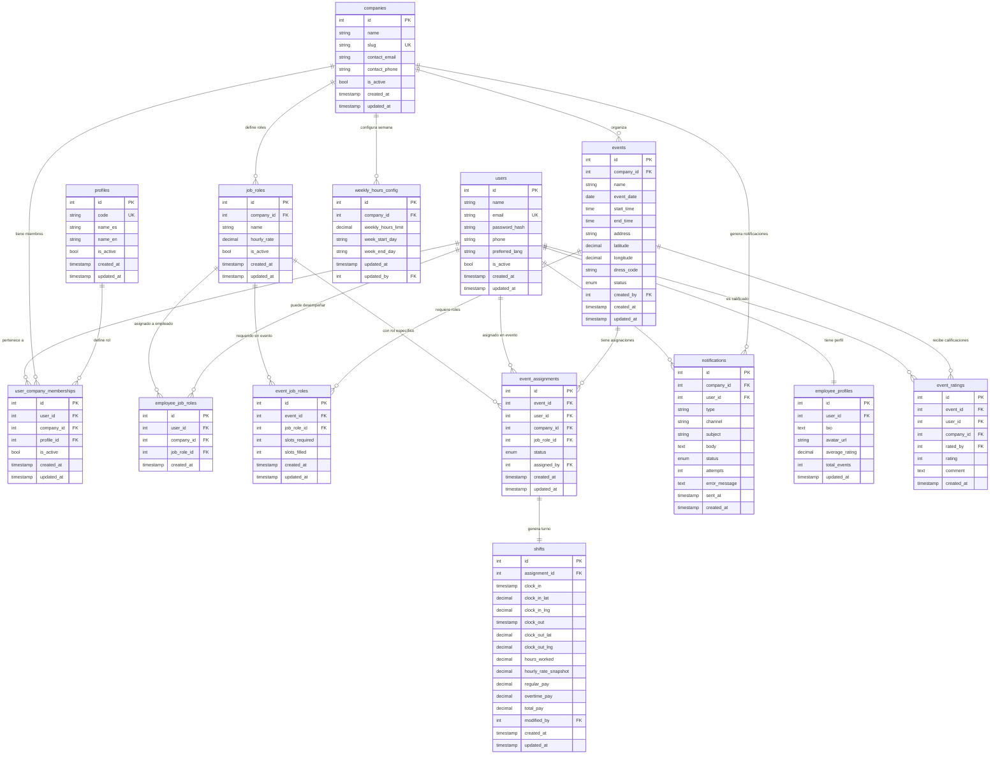

# Modelo Entidad-Relación (MER)
# Event Staffing Platform

---

## Diagrama MER Completo



---

## Descripción de Entidades y Relaciones

### `profiles` → `user_company_memberships`
Un perfil (super_admin, admin, coordinator, employee) puede estar asignado a muchas membresías. Cada membresía tiene exactamente un perfil.

### `companies` → `user_company_memberships`
Una empresa tiene muchos miembros. Un usuario puede pertenecer a muchas empresas (relación N:M resuelta por `user_company_memberships`).

### `companies` → `job_roles`
Cada empresa define sus propios roles laborales con su tarifa por hora. Un rol pertenece a una sola empresa.

### `companies` → `weekly_hours_config`
Cada empresa tiene exactamente una configuración de semana laboral (límite de horas, día inicio y fin de semana).

### `users` → `employee_job_roles`
Un empleado puede tener múltiples roles laborales dentro de una empresa. Esta tabla define qué roles puede desempeñar en cada empresa.

### `events` → `event_job_roles`
Un evento requiere uno o más roles laborales, cada uno con un número de cupos. Cuando `slots_filled = slots_required`, ese rol está completo y no acepta más aplicaciones.

### `events` → `event_assignments`
Un empleado puede tener una sola asignación por evento (`UNIQUE event_id + user_id`). La asignación incluye el rol específico con el que participa y su estado (pending → approved → removed).

### `event_assignments` → `shifts`
Cada asignación aprobada genera exactamente un turno. El turno registra clock-in/clock-out con coordenadas GPS, horas trabajadas y el cálculo de pago.

### `users` → `employee_profiles`
Relación 1:1 opcional. El perfil contiene bio, foto, calificación promedio e historial de eventos.

### `events` → `event_ratings`
Al finalizar un evento, el admin puede calificar a cada empleado (1-5). Un empleado recibe máximo una calificación por evento.

---

## Constraints Clave

| Tabla | Constraint | Descripción |
|---|---|---|
| `user_company_memberships` | UNIQUE(user_id, company_id) | Un usuario tiene un solo rol por empresa |
| `job_roles` | UNIQUE(company_id, name) | No hay roles duplicados por empresa |
| `employee_job_roles` | UNIQUE(user_id, company_id, job_role_id) | No se duplican roles por empleado/empresa |
| `event_job_roles` | UNIQUE(event_id, job_role_id) | Un rol aparece una sola vez por evento |
| `event_job_roles` | CHECK(slots_filled <= slots_required) | No se exceden los cupos |
| `event_assignments` | UNIQUE(event_id, user_id) | Un empleado, una asignación por evento |
| `shifts` | UNIQUE(assignment_id) | Una asignación genera un solo turno |
| `shifts` | CHECK(clock_out > clock_in) | El fin de turno debe ser posterior al inicio |
| `event_ratings` | UNIQUE(event_id, user_id) | Una calificación por empleado por evento |

---

## Flujo de Estados: `event_assignments.status`

```
[Evento publicado]
       │
       ▼
  PUBLISHED  ──── El empleado ve el evento disponible
       │
       │  Empleado aplica / Admin asigna directamente
       ▼
   PENDING   ──── Pendiente de aprobación del Admin
       │
       │  Admin aprueba
       ▼
  APPROVED   ──── Empleado confirmado para el evento
       │
       │  Admin remueve (en cualquier estado)
       ▼
   REMOVED   ──── Empleado removido del evento
```

---

## Notas de Diseño

- `users` no tiene `company_id` porque un usuario puede pertenecer a múltiples empresas.
- `hourly_rate` vive en `job_roles` (genérico por rol + empresa). Se copia como `hourly_rate_snapshot` en `shifts` al momento del clock-in para preservar el valor histórico.
- `week_start_day` y `week_end_day` en `weekly_hours_config` permiten que cada empresa defina su semana laboral (ej. lunes-domingo o domingo-sábado).
- `latitude`/`longitude` en `events` y `clock_in_lat`/`clock_in_lng`/`clock_out_lat`/`clock_out_lng` en `shifts` soportan la validación de geolocalización (radio ≤ 500m).
- `preferred_lang` en `users` controla el idioma de la UI y de las notificaciones.
